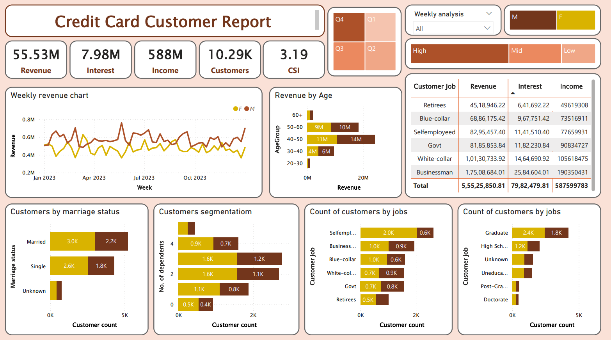
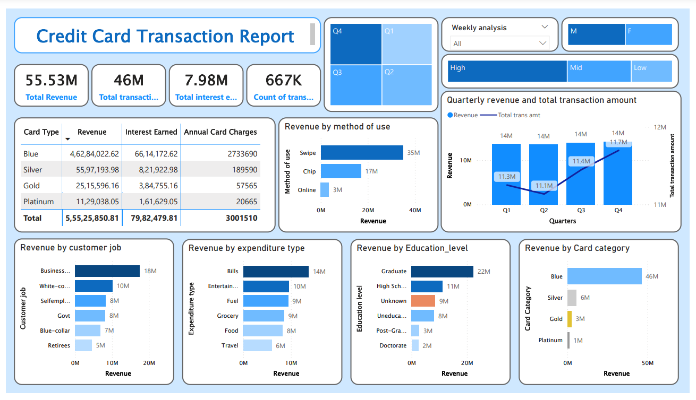

# 💳 Credit Card Customer Analytics Dashboard  

This project showcases a **Credit Card Customer Analytics Dashboard** built using **Power BI** and **PostgreSQL**. It provides a **holistic view of customer behavior and financial performance**, helping organizations **optimize strategies, enhance revenue, and manage risks effectively**.  

## 📊 Dashboard Preview  

  
  

## 🚀 Key Features  

1. **Customer Revenue Insights:**  
   - **Revenue Breakdown by Age Group** – Detailed visualization of revenue contributions segmented across various age brackets.  
   - **Top Revenue by Job and Education Levels** – Identifies key occupations such as *business owners* and *graduates* as primary revenue contributors.  
   - **High-Value Customer Identification** – Spotlights high-revenue customers based on spending patterns.  

2. **Transaction & Spending Analysis:**  
   - **Revenue by Card Category** – Breakdown of revenue from different card types (*Blue, Silver, Gold, Platinum*).  
   - **Spending Methods** – Insights into **swipe, chip, and online** transactions to track customer payment preferences.  
   - **Average Transaction Value** – Analysis of customer spending behavior per transaction.  

3. **Interactive Visualizations:**  
   - **Quarterly Revenue Trends** – Highlights revenue growth across four quarters with comparisons to total transaction amounts.  
   - **Customer Segmentation** – Categorization by **marital status, job roles, education levels, and expenditure types**.  
   - **Overdue Payment Analysis** – Identifies customers with delayed payments and overdue balances.  

## 🔧 Tasks Implemented  

- **Database Setup** – Designed and implemented a **PostgreSQL** database for structured data storage.  
- **SQL Queries** – Created optimized queries to analyze customer transactions and spending behavior.  
- **Data Cleaning & Transformation** – Processed raw data to ensure accuracy in dashboards.  
- **Power BI Dashboard Development** – Built interactive dashboards for real-time insights.  

## 🛠 Tools Used  

- **Power BI** – Interactive visualizations.  
- **PostgreSQL** – Data storage, querying, and analysis.  
- **GitHub** – Version control.  
